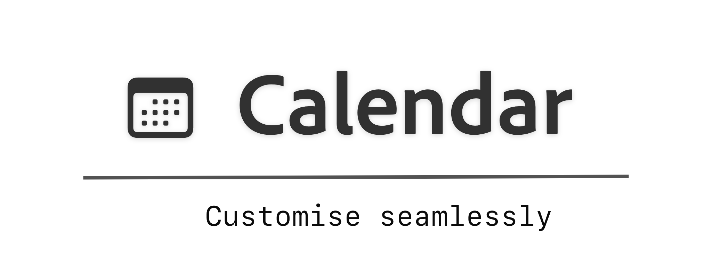
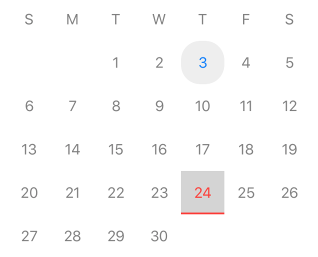
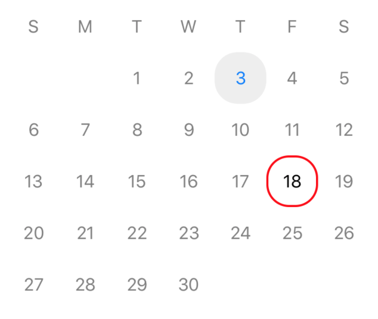
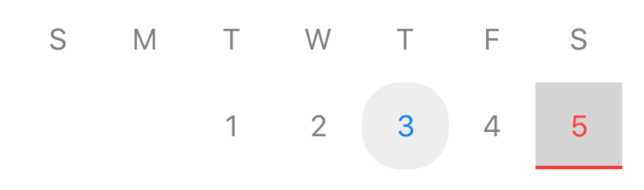

- [Overview](#overview)
- [Usage](#usage)
- [Installation Guide](#installation-guide)
- [Full Documentation](https://lenisdev.github.io/Calendar/index.html)
- [Contribute](#contribute)

### Overview
Easy to use functional calendar for iOS projects.

- Expanded *(Rect style)*



- Expanded *(Round style)*



- Collapsed *(Rect style)*



Checkout [example project](https://github.com/LenisDev/Calendar/tree/master/CalendarExamples/CalendarExamples)
### Usage
```swift

  // Step 1 - create
  let calendarView = CalendarView(data: CalendarViewModel(days: CalendarDayListViewModel(), weekDays: CalendarWeekHeaderViewModel.generateWeekDays())) { selectedDay in
        print(selectedDay)
    }
    
  // Step 2: Customize
  calendarView
    .dayStyle(CalendarDayStyle())
    .weekHeaderStyle(DefaultStyle())
    .dayPresentation(.expanded)
```

<br>

### Installation Guide

#### Carthage

Step 1: 
Add following to your CartFile

```
github "LenisDev/Calendar" ~> 0.0.1
```

Step 2:
run `carthage update` from current project directory.

*That's all, you have it installed.*

<br>

#### CocoaPods

Step 1:
Add `pod 'CustomCalendar', '~> 0.0.1'` to your Podfile:

```
target 'MyApp' do
  pod 'CustomCalendar', '~> 0.0.1'
end
```

Step 2:
run `pod install` from current project directory.

*That's all, you have it installed.*

<br>

>
>
>Try it using following command
>```
>pod try Tab
>```
>

<br>

#### Swift Package Manager
```
dependencies: [
    .package(url: "https://github.com/LenisDev/Calendar.git", .upToNextMajor(from: "0.0.1"))
]
```

<br>

### Contribute
> - Play around and report bugs
> - Fix issues and create PR
> - Add documentations and new features
